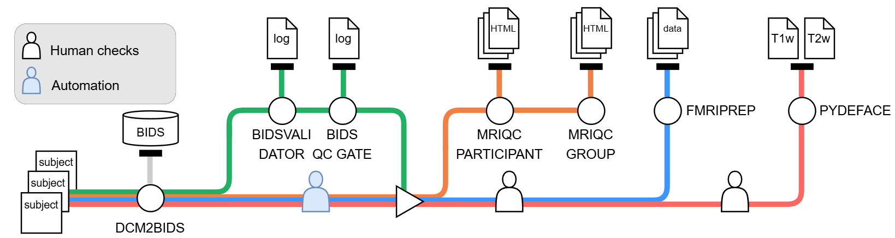
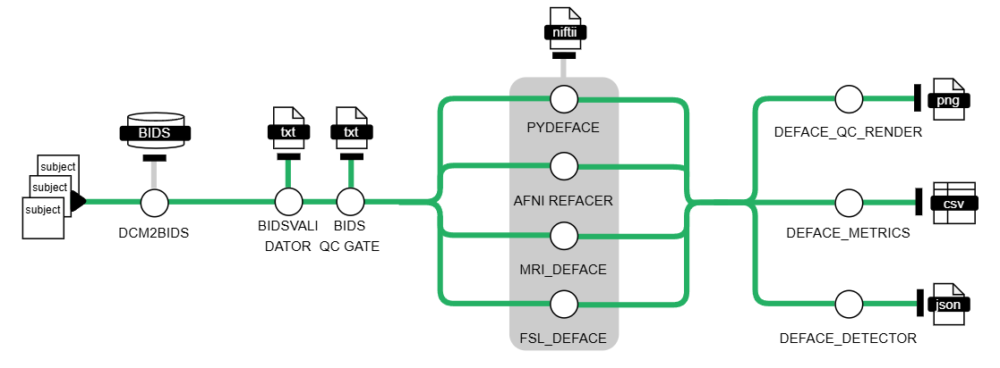
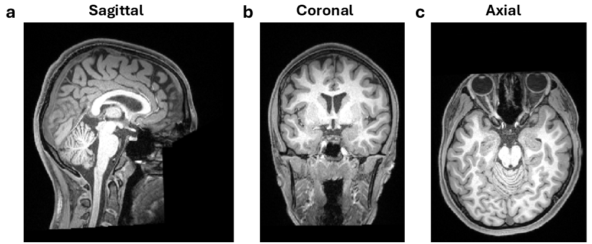

<h1>
  <picture>
    <source media="(prefers-color-scheme: dark)" srcset="docs/images/nf-core-neuromriprep_logo_dark.png">
    
  </picture>
</h1>

**neuromriprep** is a modular **Nextflow DSL2 workflow for converting, validating, quality-assessing, preprocessing, and defacing human structural and functional MRI data**. Developed for the IRTG 2804 research setting, it integrates established neuroimaging applications with study-specific acquisition mappings, metadata transformations, and quality-control policies. Its scientific contribution is a reproducible processing framework that connects scanner-derived DICOM data to organized BIDS datasets, image-quality reports, preprocessing derivatives, and separately published defaced anatomical images. A complementary benchmark workflow evaluates alternative defacing methods on matched inputs. The implementation and its initial evaluation are described in [Böhme's thesis](docs/pipeline.md#thesis-and-source-notes).

The production workflow begins with a samplesheet of DICOM participant/session directories and a study-specific **dcm2bids** configuration. Subject, session, and project metadata accompany the processing channels. Conversion maps scanner series to [BIDS](https://doi.org/10.1038/sdata.2016.44) datatypes, suffixes, and acquisition entities; per-input configuration generation adjusts supported field-map identifiers for session context. Defined post-processing rules then prepare the converted outputs for assembly into a common dataset. These rules encode institutional acquisition conventions and must be reviewed when adapting the workflow to another study. The current entry point accepts DICOM directories, and all samplesheet rows are merged into one dataset.

Dataset-level **BIDS validation** checks the assembled structure and metadata after configured ignore rules are applied. A custom production quality-control gate parses the validator log and evaluates recognized errors and warnings against a study-specific warning allowlist. With enforcement enabled, errors or non-allowlisted warnings prevent the dataset from entering downstream processing. This establishes an explicit, reviewable policy for accepted structural deviations; it does not assess whether an image is scientifically suitable for analysis. Because gate rejection filters the downstream data channel, users must inspect the gate report and expected outputs rather than infer completion from the Nextflow exit status alone.

Three independently controlled processing branches consume the same post-gate BIDS dataset:

- **Image-quality assessment:** [MRIQC](https://doi.org/10.1371/journal.pone.0184661) generates anatomical and functional image-quality metrics and visual reports. The wrapper performs one participant-level invocation over the merged dataset, optionally restricted to selected subjects, followed by group aggregation. Metrics and reports support human review; the pipeline does not automatically exclude scans based on MRIQC scores.
- **Anatomical and functional preprocessing:** [fMRIPrep](https://doi.org/10.1038/s41592-018-0235-4) performs its input-dependent preprocessing workflows and produces derivatives, confound estimates, and visual reports. The wrapper supplies participant selection, a BIDS filter, FreeSurfer licensing, and TemplateFlow resources; its default requested standard spaces are `MNI152NLin2009cAsym` and `MNI152NLin6Asym`. Statistical modeling and interpretation of fMRI effects remain downstream analysis tasks.
- **Anatomical defacing:** one selected method—**PyDeface, AFNI Refacer, MRI Deface, or FSL Deface**—processes anatomical images and publishes modified volumes separately. MRIQC and fMRIPrep use the original BIDS inputs, not the outputs of this defacing branch. Defacing therefore supports preparation for sharing but does not itself remove every identifying metadata field, replace source images, or certify protection against re-identification.

The separate **defacing benchmark** applies all four methods to the same original T1-weighted images and pairs each output with its source image. Standardized renderings, voxel/intensity-change metrics, and automated detector scores provide complementary evidence for assessing facial removal and unintended image modification. Per-image results and method-level summaries support study-specific selection and review; detector classifications are not a substitute for visual assessment. The benchmark has its own conversion and validation path and does not invoke the production gate. See the [benchmark walkthrough](#defacing-benchmark).

[Nextflow](https://doi.org/10.1038/nbt.3820) coordinates dependencies, concurrent tasks, resource requests, caching, and resumable execution, while containerized applications and explicit study configurations support repeatable processing. Stop/skip controls allow staged runs with human review between invocations; enabling all branches permits concurrent execution rather than enforcing a sequential MRIQC → fMRIPrep → defacing chain. Reproduction requires preservation of the workflow revision, inputs, configurations, container identities, reference resources, and execution records. This nf-core-derived development pipeline is not an official nf-core release: institutional paths, storage requirements, and [current implementation limitations](docs/pipeline.md#current-development-limitations) still require site-specific preparation. Its architecture supports adaptation and parallel execution, but cross-site portability and scaling are not established by the initial evaluation alone.

## FAIR research data management context

[Sezer et al. (2026)](https://doi.org/10.5281/zenodo.22099332) describe the IRTG 2804 infrastructure built by QBiC and collaborators on the **de.NBI Cloud**, and identify neuromriprep as an MRI workflow use case. The architecture combines controlled-access computation, OMERO image management, linked study metadata, and containerized Nextflow workflows. Here, neuromriprep provides MRI conversion, validation, preprocessing, and defacing; storage, access control, and metadata services belong to the surrounding infrastructure.

This approach aligns with **NFDI4BIOIMAGE** goals for interoperable formats, metadata, and reproducible image analysis. That is a conceptual alignment: the paper describes a de.NBI/QBiC deployment, not an NFDI-operated service. See [NFDI’s consortium overview](https://www.nfdi.de/consortia-nfdi4bioimage/?lang=en), [workflow/infrastructure boundaries](docs/pipeline.md#fair-oriented-infrastructure-and-nfdi-context), and the [full citation](CITATIONS.md#fair-oriented-research-data-management).

## Pipeline



_Production workflow from Böhme (2026), Figure 3.1, printed p. 40. The thesis diagram shows PyDeface; the current production workflow allows four defacer choices. [Figure source details](docs/images/README.md)._

MRIQC, fMRIPrep, and defacing branch from the merged BIDS dataset and can run concurrently. Default stop flags enable conversion and validation only; the staged commands below provide review checkpoints.

## Defacing benchmark

The `benchmark_defacing` mode helps select and review a defacing method for your study. It converts DICOM to BIDS, applies **PyDeface, AFNI Refacer, MRI Deface, and FSL Deface** to the same original T1w images, and compares their outputs using visual renderings, image-change metrics, and an automated detector. It does not run MRIQC or fMRIPrep.



_Benchmark workflow from Böhme (2026), Figure 3.3, printed p. 49. The BIDS QC gate shown in this thesis diagram is not executed by the current benchmark code; validation runs without production-gate enforcement. [Figure source details](docs/images/README.md)._

### 1. Prepare benchmark inputs

Follow the common [environment setup](#1-check-prerequisites-and-clone-the-pipeline), [DICOM naming](#2-organize-the-input-dicom-data), [conversion configuration](#3-create-the-samplesheet-and-study-configuration), and [local policy-file setup](#4-create-the-local-validation-policies). Use a small representative subset from one study and save `/data/study/benchmark_samplesheet.csv`:

```csv
project,dicom_dir
STUDY,/data/study/dicom/STUDY_001_S01
STUDY,/data/study/dicom/STUDY_002_S01
```

Each selected subject/session must produce an original `anat/*_T1w.nii.gz` image after conversion. Missing anatomical directories or nonmatching files yield no benchmark inputs for that row. Avoid duplicate rows. This mode starts from DICOM, not pre-existing NIfTI/BIDS directories; the samplesheet selects the cohort. Production participant lists, stop/skip flags, and `deface_tool` do not limit the four-method comparison.

### 2. Configure the benchmark environment

Save `benchmark.config`, replacing the paths with compatible images available on every execution node:

```groovy
process {
    withName: 'DCM2BIDS_CONFIG|DCM2BIDS_POSTPROC|MERGE_BIDS_DATASET|BIDSIGNORE' {
        ext.container = '/srv/containers/docker-curl-jq.sif'
    }
    withName: 'DCM2BIDS' {
        ext.container = '/srv/containers/dcm2bids_3.2.0.sif'
    }
    withName: 'BIDS_VALIDATOR' {
        ext.container = '/srv/containers/bidsvalidator_bash.sif'
    }
    withName: 'PYDEFACE' {
        ext.container = '/srv/containers/pydeface_3.0.sif'
    }
    withName: 'MRI_DEFACE' {
        ext.container = '/srv/containers/mri_deface.sif'
    }
    withName: 'FSL_DEFACE' {
        ext.container = '/srv/containers/fsl_deface.sif'
    }
    withName: 'AFNI_REFACER' {
        ext.container = '/srv/containers/afni_refacer_pennlinc.sif'
    }
    withName: 'DEFACE_QC_RENDER|DEFACE_METRICS' {
        ext.container = '/srv/containers/deface_benchmark.sif'
    }
    withName: 'DEFACE_DETECTOR' {
        ext.container = '/srv/containers/deface_detector.sif'
    }
    withName: 'PYDEFACE|MRI_DEFACE|FSL_DEFACE|AFNI_REFACER' {
        maxForks = 1
    }
}
```

These are example filenames, not bundled images or verified version identifiers. The helper image needs Bash, jq, and GNU coreutils. MRI Deface needs its brain/face templates; defaults are `/opt/mri_deface/talairach_mixed_with_skull.gca` and `/opt/mri_deface/face.gca` inside its image. Override `mri_deface_brain_template` and `mri_deface_face_template` in the parameter file if necessary, using paths visible inside the container.

The rendering/metrics and detector images must provide the dependencies described in the [benchmark setup guide](docs/benchmark.md#setup-and-execution). `MERGE_BENCHMARK` runs Python 3 with pandas on its execution host because it has no container directive; install those there or set a suitable `container` for that process. Add your site's executor and storage settings for HPC. The example allows one task **per defacer** concurrently, not one task for the entire workflow.

### 3. Execute and resume

Save `benchmark_params.yaml`:

```yaml
mode: benchmark_defacing
input: /data/study/benchmark_samplesheet.csv
outdir: /data/study/benchmark-results
dcm2bids_config: /data/study/dcm2bids_config.json
```

Run from the repository root, using a separate work directory on the tested reflink-capable filesystem:

```bash
nextflow run . -profile apptainer -c benchmark.config \
  -params-file benchmark_params.yaml \
  -work-dir /scratch/neuromriprep-benchmark-work
```

To resume after correcting a failure, rerun the same command with `-resume`. Retain `.nextflow/` and the work directory. The production warning allowlist and optional output-patch subworkflow are not used in this mode; inspect the validator log in its task directory.

### 4. Review the comparison

Under `/data/study/benchmark-results`, inspect:

- `benchmark_defacing/qc/*.png`: compare original and defaced images for residual facial structure and unwanted tissue removal.
- `benchmark_defacing/metrics/benchmark_per_subject_method.csv`: check completeness and individual results before interpreting `benchmark_defacing/summary/benchmark_summary_by_method.csv`.
- `benchmark_defacedet/defacedet/<method>/*.deface_qc.json` and `*.deface_qc_pass.txt`: detector scores and decisions at the wrapper's threshold of **0.5**. The thesis's subsequent analysis used **0.85**, which is not the runtime default.

Require a result for every intended image and all four methods. Verify where the defaced images were published: the current publisher has a [method-specific layout limitation](docs/output.md#benchmark-outputs), while individual task directories retain their outputs. High detector scores and small image differences do not establish successful anonymization; combine them with visual review before selecting a production defacer. See the [full benchmark guide](docs/benchmark.md) for interpretation and limitations.

## Example output



_PyDeface example from Böhme (2026), Figure 3.2, printed p. 48: sagittal, coronal, and axial slices. [Figure source details](docs/images/README.md)._

## Step-by-step technical guide

Replace `/data`, `/srv`, and `/scratch` with paths accessible on your execution host and compute nodes. Run commands from the cloned repository root.

### 1. Check prerequisites and clone the pipeline

Use Linux, Nextflow >=25.04.0, compatible Java, and Apptainer. The MRIQC/fMRIPrep wrappers require Apptainer-style execution; Docker or Conda alone is insufficient.

```bash
java -version
nextflow -version
apptainer --version
git clone --branch dev https://github.com/luiskuhn/neuromriprep.git
cd neuromriprep
git rev-parse HEAD
```

Record the commit. The bundled `test`/`test_full` profiles are template configurations, not MRI smoke tests.

Defaults request 16 CPUs/30 GB for MRIQC participant processing and 16 CPUs/60 GB per fMRIPrep task. Allow for concurrent branches. Dataset assembly requires GNU `cp --reflink=always`; test your scratch filesystem (there is no copy fallback):

```bash
mkdir -p /scratch/neuromriprep-work
printf 'reflink check\n' > /scratch/neuromriprep-work/reflink-source.txt
cp --reflink=always /scratch/neuromriprep-work/reflink-source.txt /scratch/neuromriprep-work/reflink-copy.txt
```

### 2. Organize the input DICOM data

Use one DICOM directory per participant/session. Series subdirectories are illustrative and scanner-specific:

```text
/data/study/
├── dicom/
│   ├── STUDY_001_S01/
│   │   ├── T1w_series/
│   │   │   ├── image0001.dcm
│   │   │   └── ...
│   │   ├── BOLD_series/
│   │   │   └── ...
│   │   └── fieldmap_series/
│   │       └── ...
│   └── STUDY_002_S01/
│       └── ...
├── samplesheet.csv
├── dcm2bids_config.json
├── bids_filter.json
└── license.txt
```

The entry workflow accepts DICOM, not existing BIDS/NIfTI datasets. Series-to-BIDS mapping comes from the conversion configuration, not the series folder names.

Names must follow `STUDY_001_S01` → `sub-001/ses-01`: the second underscore-separated component is the subject, and the third contains `S` plus session digits. Avoid underscores in the study prefix, `sub-` in the subject component, and whitespace in paths. Malformed names can silently become subject `unknown` or session `01`.

### 3. Create the samplesheet and study configuration

Save this CSV as `/data/study/samplesheet.csv`, using real absolute paths:

```csv
project,dicom_dir
STUDY,/data/study/dicom/STUDY_001_S01
STUDY,/data/study/dicom/STUDY_002_S01
```

All rows form one study dataset. Start small, avoid duplicate participant/session rows, and resolve the [fMRIPrep duplicate-task limitation](docs/pipeline.md#current-development-limitations) before processing multiple sessions per subject.

Obtain a reviewed `dcm2bids_config.json` for your scanner protocol. Its `descriptions` array defines series matching, BIDS entities, and field-map associations. Check the pipeline’s [session-specific field-map edits and postprocessing](docs/pipeline.md#production-stages) against your acquisitions.

For fMRIPrep, provide a valid FreeSurfer `license.txt` and `bids_filter.json` (`{}` for unrestricted input, or a reviewed acquisition filter). The default filter is absent; the `ses01`/`ses02` aliases use institutional paths.

### 4. Create the local validation policies

Create the required files without overwriting existing policies (this directory is Git-ignored):

```bash
mkdir -p assets/input_pipeline
touch assets/input_pipeline/bidsignore_list.txt
touch assets/input_pipeline/bidsignore_remove.txt
touch assets/input_pipeline/bidsval_allowlist.txt
```

Use one entry per line: `bidsignore_list.txt` adds validation exclusions; `bidsignore_remove.txt` removes exact entries; `bidsval_allowlist.txt` accepts reviewed warning codes. Empty files mean no exceptions. Errors cannot be allowlisted.

### 5. Configure containers and resources

Save as `site.config`, using existing SIF images from your site maintainer and a populated TemplateFlow cache. The helper image needs Bash, jq, and GNU coreutils; the validator needs Bash and `bids-validator`.

```groovy
process {
    withName: 'DCM2BIDS_CONFIG|DCM2BIDS_POSTPROC|MERGE_BIDS_DATASET|BIDSIGNORE' {
        ext.container = '/srv/containers/docker-curl-jq.sif'
    }
    withName: 'DCM2BIDS|DCM2BIDS_OUTPUT_PATCH' {
        ext.container = '/srv/containers/dcm2bids_3.2.0.sif'
    }
    withName: 'BIDS_VALIDATOR' {
        ext.container = '/srv/containers/bidsvalidator_bash.sif'
    }
    withName: 'BIDS_QC_GATE' {
        ext.container = '/srv/containers/python_3.11.14-trixie.sif'
    }
    withName: 'FMRIPREP' {
        ext.container = '/srv/containers/fmriprep_24.1.1.sif'
        ext.templateflow_host = '/srv/templateflow'
        cpus = 16
        memory = '60 GB'
        maxForks = 1
    }
    withName: 'PYDEFACE' {
        ext.container = '/srv/containers/pydeface_3.0.sif'
        maxForks = 1
    }
    withName: 'MRIQC_PARTICIPANT' {
        cpus = 16
        memory = '30 GB'
    }
}
```

Use `ext.container`; most declared `*_container` parameters are unwired. MRIQC participant uses `mriqc_container` below, but **MRIQC group hard-codes `/nic/sw/IRTG/sif/mriqc_25.0.0rc0.sif`**. Provide that image at that path or adapt the wrapper; changing the participant parameter does not fix group processing.

For HPC, add the scheduler executor, queue/account, and storage bindings; otherwise execution is local. This example limits fMRIPrep to one concurrent task.

### 6. Save the run parameters

Save this as `params.yaml` in the repository root, replacing the example paths:

```yaml
mode: production
input: /data/study/samplesheet.csv
outdir: /data/study/results
dcm2bids_config: /data/study/dcm2bids_config.json
bids_qc_allowlist: assets/input_pipeline/bidsval_allowlist.txt
enforce_bidsqc_gate: true
stop_bidsval: true
stop_mriqc: true
stop_fmriprep: true
skip_mriqc: false
skip_fmriprep: false
mriqc_vpn_file: null
fmriprep_vpn_file: null
pydeface_vpn_file: null
mriqc_container: /srv/containers/mriqc_25.0.0rc0.sif
fmriprep_fs_license: /data/study/license.txt
fmriprep_bids_filter: /data/study/bids_filter.json
ignore_fmriprep_fail: false
deface_tool: pydeface
```

Null lists select all participants and override missing institutional files. `ignore_fmriprep_fail: false` makes failures terminate the run. Alternative defacers (`mri_deface`, `fsl_deface`, `afni_refacer`) require corresponding images/references; see the [parameter reference](docs/usage.md#operational-parameter-reference).

Resolve and inspect the configuration before running:

```bash
nextflow config . -profile apptainer -c site.config -flat > resolved.config.txt
```

This checks configuration resolution, not data or image availability.

### 7. Convert DICOM to BIDS and review validation

```bash
nextflow run . -profile apptainer -c site.config -params-file params.yaml \
  -work-dir /scratch/neuromriprep-work \
  --stop_bidsval true --stop_mriqc true --stop_fmriprep true
```

In `/data/study/results`, check `sub-*/ses-*/`, field-map associations, `dataset_validation_log.txt`, and `bids_qc_summary.txt`. Require `check_passed: True`: gate rejection can still yield a successful Nextflow exit. Correct source inputs/configuration, not published copies, then rerun with `-resume`.

### 8. Run MRIQC and inspect image quality

```bash
nextflow run . -profile apptainer -c site.config -params-file params.yaml \
  -work-dir /scratch/neuromriprep-work -resume \
  --stop_bidsval false --stop_mriqc true --stop_fmriprep true
```

Review reports and metrics in `derivatives/mriqc/` for artifacts, motion, coverage, and outliers; scans are not automatically excluded. Keep both skip flags false and `stop_fmriprep` true: `stop_mriqc` alone does not block defacing.

### 9. Run fMRIPrep and inspect preprocessing

```bash
nextflow run . -profile apptainer -c site.config -params-file params.yaml \
  -work-dir /scratch/neuromriprep-work -resume \
  --stop_bidsval false --stop_mriqc false --stop_fmriprep true
```

Review `derivatives/fmriprep/` reports for registration, normalization, segmentation, and confounds. Confirm completion for every requested participant.

### 10. Deface anatomical images and review the results

```bash
nextflow run . -profile apptainer -c site.config -params-file params.yaml \
  -work-dir /scratch/neuromriprep-work -resume \
  --stop_bidsval false --stop_mriqc false --stop_fmriprep false \
  --deface_tool pydeface
```

Inspect `derivatives/defaces/sub-*/ses-*/anat/` for residual facial features and lost brain tissue. Original BIDS images remain; review the specific files intended for sharing. Production does not run the benchmark renderer/detector.

For `-resume`, retain the launch directory, `.nextflow/` cache, and work directory. Enabling all stages on a fresh run permits concurrent processing without review pauses.

Archive the commit, parameters/configuration, image identities, and reports. Consult [output diagnostics](docs/output.md), [stop/skip combinations](docs/production_workflow_guide.md#other-execution-patterns), and [troubleshooting](docs/usage.md#troubleshooting-and-reproducibility).

## Documentation

- [Documentation index](docs/README.md)
- [Technical setup, inputs, configuration, and troubleshooting](docs/usage.md)
- [Step-by-step production runs and review checkpoints](docs/production_workflow_guide.md)
- [Pipeline architecture and thesis context](docs/pipeline.md)
- [Outputs and quality-control review](docs/output.md)
- [Defacing benchmark](docs/benchmark.md)
- [Verified lessons from the prototype](docs/prototype-notes.md)

## Credits and support

Contributors include Luis, Mahnaz, Carolin Schwitalla, and Lorena Böhme. This documentation draws on Böhme's 2026 master's thesis, _neuromriprep: A Nextflow Pipeline for Reproducible Preprocessing and Anonymization for Functional MRI Data_, and checks operational details against the current source. See [source notes and limitations](docs/pipeline.md#thesis-and-source-notes) and the [references below](#references).

For bugs or questions, [open an issue](https://github.com/luiskuhn/neuromriprep/issues). See the [contribution guidelines](docs/CONTRIBUTING.md) and [MIT license](LICENSE).

## References

This list consolidates the scientific references in the repository's guides, [citation file](CITATIONS.md), [module metadata](modules/local/bidsvalidator/meta.yml), and [methods template](assets/methods_description_template.yml), with MRIQC and fMRIPrep papers added for the documented MRI workflow. Cite the tools actually used, their versions, and the pipeline commit; this development repository does not declare a pipeline DOI. Placeholder DOIs and test-fixture identifiers are not pipeline citations.

### Workflow, MRI standards, and research infrastructure

- **Research infrastructure:** Sezer, Z. H., et al. (2026). _de.NBI Cloud Enables FAIR-oriented Management and Reproducible Workflows for Sensitive Bioimage Data in Mental Health Studies_. IWSG2026. DOI: [10.5281/zenodo.22099332](https://doi.org/10.5281/zenodo.22099332). This identifies the infrastructure paper, not a neuromriprep release.
- **BIDS:** Gorgolewski, K. J., et al. (2016). _The brain imaging data structure, a format for organizing and describing outputs of neuroimaging experiments_. Scientific Data, 3, 160044. DOI: [10.1038/sdata.2016.44](https://doi.org/10.1038/sdata.2016.44).
- **MRIQC:** Esteban, O., et al. (2017). _MRIQC: Advancing the automatic prediction of image quality in MRI from unseen sites_. PLOS ONE, 12(9), e0184661. DOI: [10.1371/journal.pone.0184661](https://doi.org/10.1371/journal.pone.0184661).
- **fMRIPrep:** Esteban, O., et al. (2019). _fMRIPrep: a robust preprocessing pipeline for functional MRI_. Nature Methods, 16, 111–116. DOI: [10.1038/s41592-018-0235-4](https://doi.org/10.1038/s41592-018-0235-4).
- **Nextflow:** Di Tommaso, P., et al. (2017). _Nextflow enables reproducible computational workflows_. Nature Biotechnology, 35, 316–319. DOI: [10.1038/nbt.3820](https://doi.org/10.1038/nbt.3820).
- **nf-core:** Ewels, P. A., et al. (2020). _The nf-core framework for community-curated bioinformatics pipelines_. Nature Biotechnology, 38, 276–278. DOI: [10.1038/s41587-020-0439-x](https://doi.org/10.1038/s41587-020-0439-x). Cited for the framework/template; neuromriprep is not currently an official nf-core pipeline.
- **Singularity:** Kurtzer, G. M., Sochat, V., & Bauer, M. W. (2017). _Singularity: Scientific containers for mobility of compute_. PLOS ONE, 12(5), e0177459. DOI: [10.1371/journal.pone.0177459](https://doi.org/10.1371/journal.pone.0177459). Background for the container ecosystem; the run guide uses Apptainer.

### Additional references retained from the repository template

These references appear in the inherited citation file or methods template. Their inclusion does not establish use in an MRI run; FastQC and MultiQC are not stages of the current MRI workflow.

- **MultiQC:** Ewels, P., et al. (2016). _MultiQC: summarize analysis results for multiple tools and samples in a single report_. Bioinformatics, 32(19), 3047–3048. DOI: [10.1093/bioinformatics/btw354](https://doi.org/10.1093/bioinformatics/btw354).
- **Bioconda:** Grüning, B., et al. (2018). _Bioconda: sustainable and comprehensive software distribution for the life sciences_. Nature Methods, 15, 475–476. DOI: [10.1038/s41592-018-0046-7](https://doi.org/10.1038/s41592-018-0046-7).
- **BioContainers:** da Veiga Leprevost, F., et al. (2017). _BioContainers: an open-source and community-driven framework for software standardization_. Bioinformatics, 33(16), 2580–2582. DOI: [10.1093/bioinformatics/btx192](https://doi.org/10.1093/bioinformatics/btx192).
- **Docker:** Merkel, D. (2014). _Docker: lightweight Linux containers for consistent development and deployment_. Linux Journal, 2014(239), article 2. ACM bibliographic identifier: [10.5555/2600239.2600241](https://dl.acm.org/doi/10.5555/2600239.2600241).

### Thesis and related resources without a verified DOI

- **Thesis and figures:** Böhme, L. (2026). _neuromriprep: A Nextflow Pipeline for Reproducible Preprocessing and Anonymization for Functional MRI Data_. Master's thesis in Bioinformatics, University of Tübingen, 23 July 2026. Supplied PDF; see [figure attribution](docs/images/README.md) and [source notes](docs/pipeline.md#thesis-and-source-notes). No public URL or DOI is asserted.
- **Precursor implementation:** [IRTG_MRI_ImagePreprocessing documentation](https://github.com/luiskuhn/IRTG_MRI_ImagePreprocessing/blob/7cb194818a6905494a9b28b57cb0f9a02817f4f2/docs/usage.md), pinned to commit `7cb1948`; see [verified lessons](docs/prototype-notes.md).
- **NFDI context:** [NFDI4BIOIMAGE consortium description](https://www.nfdi.de/consortia-nfdi4bioimage/?lang=en).
- **FastQC (template resource):** Andrews, S. (2010). _FastQC: A Quality Control Tool for High Throughput Sequence Data_. [Project website](https://www.bioinformatics.babraham.ac.uk/projects/fastqc/).
- **Anaconda (template resource):** _Anaconda Software Distribution_ (2016), version 2-2.4.0, as cited in the inherited citation file. [Project website](https://www.anaconda.com/).
